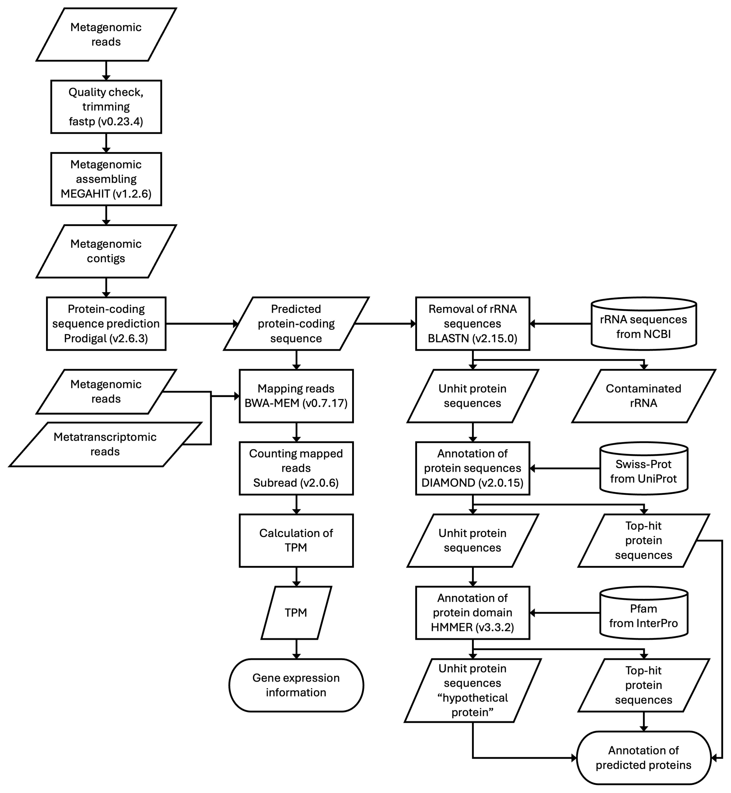

[](https://github.com/common-workflow-language/cwltool/releases/tag/3.1.20250110105449)
[](./LICENSE)
[](https://github.com/yonesora56/plant2human/tree/main/.devcontainer)

# Gene Expression Analysis Workflow in Complex Microbiomes

&nbsp;

## Workflow Schema 
- more details: [Optimization of Mapping Tools and Investigation of Ribosomal RNA Influence for Data-Driven Gene Expression Analysis in Complex Microbiomes](https://doi.org/10.3390/microorganisms13050995)



&nbsp;

### 1. Overview of the Workflow

This analysis focuses on transcriptional profiling of complex microbiomes. It requires both metagenomic and metatranscriptomic NGS short-read data, along with annotation reference information (e.g., ribosomal RNA sequences and referenced protein databases, listed below). The metagenomic and metatranscriptomic reads should be derived from the same microbiome samples. Assembled metagenomic contigs are then used as reference sequences to map both types of reads, enabling gene-level quantification.

&nbsp;

### 2. Minimum Requirements

- `Docker`
- `cwltool`

&nbsp;

### 3. Workflow Component

This analysis workflow is composed of three sub-workflows; metagenomic contig assembling, reads mapping and annotation. 

&nbsp;

#### Metagenomic contig assembling

In this process, the following steps are performed:


1. Assembly process using `Megahit`. 
2. Prediction Protein sequences using `Prodigal`.
3. Statical analysis of contigs useing `SeqKit`.

&nbsp;

#### Reads mapping

In this process, the following steps are performed:

1. Mapping process using `BWA MEM`.
2. Statical analysis of mapping results using `SAMtools`

&nbsp;

#### Annotation

In this process, the following steps are performed:

1. Searching contaminated ribosomal RNA sequences using `BLAST`.
2. Searching referenced proteins using `DIAMOND`.
3. Creation GTF formated file contained annotation informations.

&nbsp;

### 4. Test Dataset and Your Own Dataset

- If you are testing with the following files, please place them in the `Data` directory!
- You can also obtain metagenomic and metatranscriptomic FASTQ files by downloading from public databases or obtaining your interested samples, then put them on your `Data` directory.

#### Metagenome data

- [SRR27548858](https://www.ncbi.nlm.nih.gov/sra/?term=SRR27548858)

#### Metatranscriptome data

- [SRR27548863](https://www.ncbi.nlm.nih.gov/sra/?term=SRR27548863)
- [SRR27548864](https://www.ncbi.nlm.nih.gov/sra/?term=SRR27548864)
- [SRR27548865](https://www.ncbi.nlm.nih.gov/sra/?term=SRR27548865)

&nbsp;

### 5. Annotation References

- These references are used on BLAST and DIAMOND processes. Downloaded files are available on `Data` directory (accessed on 17,September,2025). If you want to use the latest vesions of references, please download using following scripts.

```bash
# rRNA data from SILVA website (release138.1; accessed on 17,September,2025)
curl -O https://ftp.arb-silva.de/release_138.1/Exports/SILVA_138.1_LSUParc_tax_silva.fasta.gz
curl -O https://ftp.arb-silva.de/release_138.1/Exports/SILVA_138.1_SSUParc_tax_silva.fasta.gz

# Swiss-Prot data from UniProt for diamond makedb process (accessed on 17,September,2025)
curl -O https://ftp.uniprot.org/pub/databases/uniprot/current_release/knowledgebase/complete/uniprot_sprot.fasta.gz

# Pfam data from InterPro (accessed on 17,September,2025)) for hmmscan proess. Appling HMMER process in this workflow is on going, however this process takes time. This step will be optional.
# curl -O https://ftp.ebi.ac.uk/pub/databases/Pfam/current_release/Pfam-A.hmm.gz
```

&nbsp;

### 6. Command Execution

```bash
# main workflow

cwltool --debug --outdir <output directory> ./Worlkflow/main_w.cwl ./config/main_w.yml

```

&nbsp;

### 7. based shell script & python script

GitHub: https://github.com/RyoMameda/workflow

